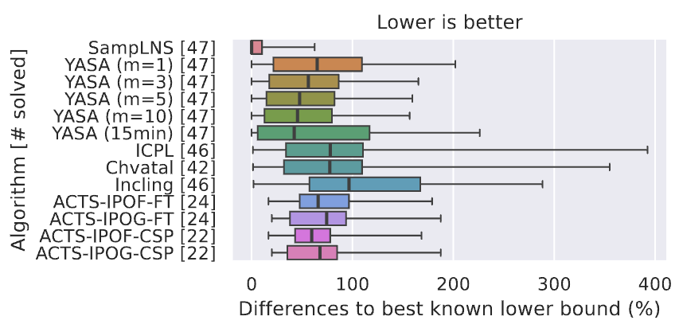

# SampLNS: A Large Neighborhood Search for Pairwise Interaction Sampling

This is the implementation and its evaluation of the paper _How Low Can We Go?
Minimizing Interaction Samples for Configurable Systems_ by
[Dominik Krupke](https://github.com/d-krupke), Ahmad Moradi, Michael Perk,
Phillip Keldenich, Gabriel Gehrke, Sebastian Krieter, Thomas Thüm, and Sándor P.
Fekete
([ACM Transactions on Software Engineering and Methodology 2024](https://dl.acm.org/doi/10.1145/3712193)).
It has been developed by [Dominik Krupke](https://github.com/d-krupke), Michael
Perk, Phillip Keldenich, and Gabriel Gehrke, and Sebastian Krieter. For any
questions, please open an issue or contact [Dominik Krupke](https://github.com/d-krupke).

> **Abstract:** Modern software systems are typically configurable, a
> fundamental prerequisite for wide applicability and reusability. This
> flexibility poses an extraordinary challenge for quality assurance, as the
> enormous number of possible configurations makes it impractical to test each
> of them separately. This is where _t-wise interaction sampling_ can be used to
> systematically cover the configuration space and detect unknown feature
> interactions. Over the last two decades, numerous algorithms for computing
> small interaction samples have been studied, providing improvements for a
> range of heuristic results; nevertheless, it has remained unclear how much
> these results can still be improved.
>
> We present a significant breakthrough: a fundamental framework, based on the
> mathematical principle of _duality_, for combining near-optimal solutions with
> provable lower bounds on the required sample size. This implies that we no
> longer need to work on heuristics with marginal or no improvement, but can
> certify the solution quality by establishing a limit on the remaining gap; in
> many cases, we can even prove optimality of achieved solutions. This
> theoretical contribution also provides extensive practical improvements: Our
> algorithm SampLNS was tested on **47** small and medium-sized configurable
> systems from the existing literature. SampLNS can reliably find samples of
> smaller size than previous methods in **85%** of the cases; moreover, we can
> achieve and prove optimality of solutions for **63%** of all instances. This
> makes it possible to avoid cumbersome efforts of minimizing samples by
> researchers as well as practitioners, and substantially save testing resources
> for most configurable systems.

## Comparison of SampLNS with Algorithms from the Literature

|                                                                                                                                                                                                                                                                                                                                                                                                                                                                                                                                                                                                                                                   |
| :------------------------------------------------------------------------------------------------------------------------------------------------------------------------------------------------------------------------------------------------------------------------------------------------------------------------------------------------------------------------------------------------------------------------------------------------------------------------------------------------------------------------------------------------------------------------------------------------------------------------------------------------------------------------------------------------: |
| Differences of the sample sizes of various sampling algorithms (with a 900-second time limit) to the best lower bound computed by SampLNS. Not all algorithms were able to compute a feasible sample within the time limit, thus, the number of successfully solved models is added in parentheses. We can see that SampLNS never timed out, and 75% of the samples are at most 10% above the lower bound. More than 55% of the samples match the lower bound and, thus, are minimal. The next best algorithm is YASA with m=10 (resp. the 15-minute variant) with a median difference of 46% (resp. 42%). Incling yields the largest samples, with a median of twice the size of the lower bound. |

| Feature Model        | Features | Clauses | Min    | Mean (Min)      | Mean (Max)      | Savings      | UB/LB       | Time to Bounds            |
| -------------------- | -------- | ------- | ------ | --------------- | --------------- | ------------ | ----------- | ------------------------- |
| calculate            | 9        | 15      | 9      | **5** (**5**)   | **5** (**5**)   | 44% (44%)    | 1.00 (1.00) | <1 second (1 second)      |
| lcm                  | 9        | 16      | 8      | **6** (**6**)   | **6** (**6**)   | 25% (25%)    | 1.00 (1.00) | <1 second (<1 second)     |
| email                | 10       | 17      | **6**  | **6** (**6**)   | **6** (**6**)   | 0% (0%)      | 1.00 (1.00) | <1 second (<1 second)     |
| ChatClient           | 14       | 20      | **7**  | **7** (**7**)   | **7** (**7**)   | 0% (0%)      | 1.00 (1.00) | 1 second (2 seconds)      |
| toybox_2006-10-31... | 16       | 13      | 9      | **8** (**8**)   | **8** (**8**)   | 11% (11%)    | 1.00 (1.00) | 1 second (1 second)       |
| car                  | 16       | 33      | 6      | **5** (**5**)   | **5** (**5**)   | 17% (17%)    | 1.00 (1.00) | <1 second (<1 second)     |
| FeatureIDE           | 19       | 27      | 9      | **8** (**8**)   | **8** (**8**)   | 11% (11%)    | 1.00 (1.00) | 271 seconds (128 seconds) |
| FameDB               | 22       | 40      | **8**  | **8** (**8**)   | **8** (**8**)   | 0% (0%)      | 1.00 (1.00) | 1 second (1 second)       |
| APL                  | 23       | 35      | 9      | **7** (**7**)   | **7** (**7**)   | 22% (22%)    | 1.00 (1.00) | 1 second (1 second)       |
| SafeBali             | 24       | 45      | **11** | **11** (**11**) | **11** (**11**) | 0% (0%)      | 1.00 (1.00) | <1 second (<1 second)     |
| TightVNC             | 28       | 39      | 11     | **8** (**8**)   | **8** (**8**)   | 27% (27%)    | 1.00 (1.00) | 16 seconds (21 seconds)   |
| APL-Model            | 28       | 40      | 10     | **8** (**8**)   | **8** (**8**)   | 20% (20%)    | 1.00 (1.00) | 14 seconds (15 seconds)   |
| gpl                  | 38       | 99      | 17     | **16** (**16**) | **16** (**16**) | 5.9% (5.9%)  | 1.00 (1.00) | 3 seconds (3 seconds)     |
| SortingLine          | 39       | 77      | 12     | **9** (**9**)   | **9** (**9**)   | 25% (25%)    | 1.00 (1.00) | 8 seconds (9 seconds)     |
| dell                 | 46       | 244     | 32     | **31** (**31**) | **31** (**31**) | 3.1% (3.1%)  | 1.00 (1.00) | 29 seconds (45 seconds)   |
| PPU                  | 52       | 109     | **12** | **12** (**12**) | **12** (**12**) | 0% (0%)      | 1.00 (1.00) | 2 seconds (2 seconds)     |
| berkeleyDB1          | 76       | 147     | 19     | **15** (**15**) | **15** (**15**) | 21% (21%)    | 1.00 (1.00) | 77 seconds (137 seconds)  |
| axTLS                | 96       | 183     | 16     | 11 (11)         | 10 (10)         | 31% (31%)    | 1.10 (1.10) | 20 seconds (20 seconds)   |
| Violet               | 101      | 203     | 23     | 17 (17)         | 16 (16)         | 26% (26%)    | 1.06 (1.06) | 476 seconds (656 seconds) |
| berkeleyDB2          | 119      | 346     | 20     | 12 (12)         | 12 (12)         | 40% (40%)    | 1.00 (1.00) | 162 seconds (282 seconds) |
| soletta_2015-06-2... | 129      | 192     | 30     | 24 (24)         | 24 (24)         | 20% (20%)    | 1.00 (1.00) | 21 seconds (60 seconds)   |
| BattleofTanks        | 144      | 769     | 451    | 320 (295)       | 256 (256)       | 29% (35%)    | 1.25 (1.15) | 887 seconds (160 minutes) |
| BankingSoftware      | 176      | 280     | 40     | **29** (**29**) | **29** (**29**) | 28% (28%)    | 1.00 (1.00) | 306 seconds (429 seconds) |
| fiasco_2017-09-26... | 230      | 1181    | 234    | 225 (225)       | 225 (225)       | 3.8% (3.9%)  | 1.00 (1.00) | 382 seconds (579 seconds) |
| fiasco_2020-12-01... | 258      | 1542    | 209    | 196 (196)       | 196 (196)       | 6.1% (6.2%)  | 1.00 (1.00) | 438 seconds (478 seconds) |
| uclibc_2008-06-05... | 263      | 1699    | 505    | 505 (505)       | 505 (505)       | 0% (0%)      | 1.00 (1.00) | 104 seconds (67 seconds)  |
| uclibc_2020-12-24... | 272      | 1670    | 365    | 365 (365)       | 365 (365)       | 0% (0%)      | 1.00 (1.00) | 108 seconds (112 seconds) |
| E-Shop               | 326      | 499     | 19     | 12 (12)         | 9 (10)          | 37% (37%)    | 1.30 (1.20) | 268 seconds (64 minutes)  |
| toybox_2020-12-06... | 334      | 92      | 18     | 13 (13)         | 7 (8)           | 28% (28%)    | 1.71 (1.62) | 532 seconds (35 minutes)  |
| DMIE                 | 366      | 627     | 26     | 16 (16)         | 16 (16)         | 38% (38%)    | 1.00 (1.00) | 104 seconds (135 seconds) |
| soletta_2017-03-0... | 458      | 1862    | 56     | 37 (37)         | 31 (37)         | 34% (34%)    | 1.16 (1.00) | 387 seconds (24 minutes)  |
| busybox_2007-01-2... | 540      | 429     | 34     | 21 (21)         | 21 (21)         | 38% (38%)    | 1.00 (1.00) | 164 seconds (237 seconds) |
| fs_2017-05-22        | 557      | 4992    | 398    | 396 (396)       | 396 (396)       | 0.5% (0.5%)  | 1.00 (1.00) | 478 seconds (575 seconds) |
| WaterlooGenerated    | 580      | 879     | 144    | 82 (82)         | 82 (82)         | 43% (43%)    | 1.00 (1.00) | 223 seconds (310 seconds) |
| financial_services   | 771      | 7238    | 4384   | 4368 (4340)     | 4274 (4336)     | 0.36% (1%)   | 1.02 (1.00) | 862 seconds (102 minutes) |
| busybox-1_18_0       | 854      | 1164    | 26     | 16 (16)         | 11 (13)         | 35% (38%)    | 1.53 (1.23) | 233 seconds (59 minutes)  |
| busybox-1_29_2       | 1018     | 997     | 36     | 22 (22)         | 17 (21)         | 38% (39%)    | 1.26 (1.05) | 465 seconds (60 minutes)  |
| busybox_2020-12-1... | 1050     | 996     | 33     | 21 (20)         | 17 (19)         | 36% (39%)    | 1.19 (1.05) | 407 seconds (17 minutes)  |
| am31_sim             | 1178     | 2747    | 60     | 36 (33)         | 26 (29)         | 39% (45%)    | 1.36 (1.14) | 699 seconds (77 minutes)  |
| EMBToolkit           | 1179     | 5414    | 1881   | 1879 (1872)     | 1821 (1872)     | 0.1% (0.48%) | 1.03 (1.00) | 863 seconds (47 minutes)  |
| atlas_mips32_4kc     | 1229     | 2875    | 66     | 38 (36)         | 31 (33)         | 41% (45%)    | 1.22 (1.09) | 548 seconds (50 minutes)  |
| eCos-3-0_i386pc      | 1245     | 3723    | 64     | 43 (39)         | 31 (36)         | 32% (39%)    | 1.38 (1.08) | 621 seconds (146 minutes) |
| integrator_arm7      | 1272     | 2980    | 66     | 38 (36)         | 30 (33)         | 41% (45%)    | 1.28 (1.09) | 681 seconds (82 minutes)  |
| XSEngine             | 1273     | 2942    | 63     | 38 (36)         | 31 (32)         | 39% (43%)    | 1.23 (1.12) | 572 seconds (52 minutes)  |
| aaed2000             | 1298     | 3036    | 87     | 55 (52)         | 51 (51)         | 36% (40%)    | 1.09 (1.02) | 707 seconds (75 minutes)  |
| FreeBSD-8_0_0        | 1397     | 15692   | 76     | 47 (41)         | 27 (30)         | 38% (46%)    | 1.72 (1.37) | 831 seconds (120 minutes) |
| ea2468               | 1408     | 3319    | 65     | 38 (36)         | 31 (32)         | 41% (45%)    | 1.24 (1.12) | 721 seconds (67 minutes)  |
|                      |          |         |        |                 |                 |              |             |                           |
| **optimality**       |          |         | 7      | ≥ 26            |                 |              |             |                           |
|                      |          |         | [15%]  | [55%]           |                 |              |             |                           |
| **improvements**     |          |         |        |                 | 40 [85%]        |              |             |                           |

Comparison of SampLNS with algorithms from the literature. Here, "Baseline"
indicates the best sample size found by any of the existing algorithms, each
having five runs of 15 minutes. "SampLNS UB" shows the sample size found by
SampLNS with the initial numbers indicating the mean over five runs of 15
minutes each, i.e., typical outcomes for a short run, while the numbers in
parentheses describe the best of five extended runs of up to 3 hours, i.e., the
potential outcomes of longer runs. Similarly, "SampLNS LB" is the lower bound,
while "Savings" quantifies the reduction in sample size achieved by SampLNS
compared to previous algorithms. "SampLNS UB/LB" illustrates the relationship
between upper and lower bounds, with a value of 1.0 implying optimality. "Time
to bounds" records the moment when final lower and upper bounds were
established, potentially preceding the time limit. A low value may signal
efficiency, yet it could also suggest stagnation, depending on the solution
quality at that moment.

- **Baseline**: Best sample size found by existing algorithms in five runs of 15
  minutes.
- **SampLNS UB (min)**: Mean sample size found by SampLNS in five 15-minute
  runs. Best result from longer runs in parentheses.
- **SampLNS LB (max)**: Lower bound of the sample size.
- **Savings (%):** Reduction in sample size compared to previous methods.
- **UB/LB:** Ratio between upper and lower bounds (1.0 means optimality).
- **Time to Bounds:** Time when final bounds were established (indicates
  efficiency vs. stagnation).

## Installation

SampLNS is a Python-library that comes with a CLI. It can be easily installed
with the Python package manager `pip`, which also handles most of the
dependencies (except for a C++-compiler and a Java runtime environment). All C++
and Java dependencies are compiled automatically during installation for most
systems. If you already have an activated Gurobi-license, the installation
should be done with a simple `pip install .` (we consider a simple installation
of scientific projects important to allow verifying reproducibility). We
recommend a Linux system, but it should also work on Windows and Mac. After
installation, we recommend to check out the examples in `examples/` to get
started.

> It is highly recommended to use
> [(ana)conda](https://www.anaconda.com/download). It not only makes the
> installation of
> [Gurobi](https://www.gurobi.com/documentation/current/quickstart_windows/cs_anaconda_and_grb_conda_.html)
> much easier, but also prevents your system from being polluted with
> dependencies.

This package requires a valid license of the commercial MIP-solver Gurobi. You
can get a free license for academic purposes. These academic licenses are fairly
easy to obtain, as explained in
[this video](https://www.youtube.com/watch?v=oW6ma8rdZk8):

1. Register an academic account.
2. Install Gurobi (very easy with Conda, you only need the tool `grbgetkey`).
3. Use `grbgetkey` to set up a license on your computer. You may have to be
   within the university network for this to work.

After you got your license, move into the folder with `setup.py` and run

```shell
pip install -v .
```

This command should automatically install all dependencies and build the
package. The package contains native C++-code that is compiled during
installation. This requires a C++-compiler. On most systems, this should be
installed by default. If not, you can install it via

```shell
sudo apt install build-essential  # Ubuntu
sudo pacman -S base-devel         # Arch
```

If you don't have initial samples at hand you might want to generate initial
samples for SampLNS with FeatJAR. This requires you to install Java version 11
or higher.

```shell
sudo apt-get install openjdk-11-jdk
```

Generally, the installation will take a while as it has to compile the C++, but
it should work out of the box. If you encounter any problems, please open an
issue. Unfortunately, the performance of native code is bought with a more
complex installation process, and it is difficult to make it work on all
systems. Windows systems are especially difficult to support. We suggest using a
Linux system.

If there are problems with the C++-compilation, you can also check out
[these common problems](https://github.com/d-krupke/skbuild-conan#common-problems).

## Usage

We provide a CLI and a Python interface. The CLI is the easiest way to get
started. If you have an initial sample you can use it as follows:

```shell
samplns -f <path/to/model> --initial-sample <path/to/intial/sample>
```

If you do not have an initial sample, you can use the following command to
compute one with YASA:

```shell
samplns -f <path/to/model> --initial-sample-algorithm YASA
```

For further options see help:

```shell
samplns --help
usage: samplns [-h] -f FILE [-o OUTPUT] (--initial-sample INITIAL_SAMPLE | --initial-sample-algorithm {YASA,YASA3,YASA5,YASA10}) [--initial-sample-algorithm-timelimit INITIAL_SAMPLE_ALGORITHM_TIMELIMIT] [--samplns-timelimit SAMPLNS_TIMELIMIT] [--samplns-max-iterations SAMPLNS_MAX_ITERATIONS] [--samplns-iteration-timelimit SAMPLNS_ITERATION_TIMELIMIT] [--cds-iteration-timelimit CDS_ITERATION_TIMELIMIT]

Starts samplns either with a given initial sample or runs another sampling algorithm before.

options:
  -h, --help            show this help message and exit
  -f FILE, --file FILE  File path to the instance (either FeatJAR xml or DIMACS format.)
  -o OUTPUT, --output OUTPUT
                        File path to the output file. Default: sample.json
  --initial-sample INITIAL_SAMPLE
                        Set this when you already have an initial sample. File path to an initial sample (JSON) that should be used.
  --initial-sample-algorithm {YASA,YASA3,YASA5,YASA10}
                        Set this if you want to run a sampling algorithm to generate an initial sample. YASA has several versions for different values of m.
  --initial-sample-algorithm-timelimit INITIAL_SAMPLE_ALGORITHM_TIMELIMIT
                        Timelimit of the initial sampling algorithm in seconds.
  --samplns-timelimit SAMPLNS_TIMELIMIT
                        Timelimit of samplns in seconds.
  --samplns-max-iterations SAMPLNS_MAX_ITERATIONS
                        Maximum number of iterations for samplns.
  --samplns-iteration-timelimit SAMPLNS_ITERATION_TIMELIMIT
                        Timelimit for each iteration of samplns in seconds.
  --cds-iteration-timelimit CDS_ITERATION_TIMELIMIT
                        Timelimit for each iteration of the lower bound computation in seconds.
```

If you want to use the Python interface, you can check out the following example
from `examples/`:

```python
import json

from samplns.simple import SampLns
from samplns.instances import parse

if __name__ == "__main__":
    feature_model = parse("./toybox_2006-10-31_23-30-06/model.xml")
    with open("./yasa_sample.json") as f:
        initial_sample = json.load(f)
    solver = SampLns(
        instance=feature_model,
        initial_solution=initial_sample,
    )

    solver.optimize(
        iterations=10000,
        iteration_timelimit=60.0,
        timelimit=900,
    )
    optimized_sample = solver.get_best_solution(verify=True)
    print(
        f"Reduced initial sample of size {len(initial_sample)} to {len(optimized_sample)}"
    )
    print(f"Proved lower bound is {solver.get_lower_bound()}.")
```

> ! The samples have to be lists of fully defined dictionaries. Otherwise, the
> results may be wrong. We will add automatic warnings for that soon.

## Logging

The optimizer uses the Python logging module. You can configure it as you like.
The default logger is named "SampLNS" and does not print anything. You can
change the logging level by adding the following lines to your code:

```python
import logging

logging.getLogger("SampLNS").basicConfig(
    format="%(levelname)s:%(message)s", level=logging.INFO
)
```

You can also pass a custom logger to the optimizer. This is useful if you want
to capture the log messages for analysis.

## Modules

### Parsing and Preprocessing

We parse the instances and preprocess them into instances where the essential
feature, i.e., features/variables that are not just auxiliary, are continously
indexed starting at zero. The other features are appended also as indices.
Additionally, some basic simplifications are performed, such as substituting
simple equality constraints or pulling unary clauses up.

This module should possibly be extracted and provide a simple export/import
functionallity.

### CDS

The CDS part tries to find tuples of feature literal-pairs that cannot appear
within the same sample. This is a very effective lower bound for the instances
we have seen and it also helps in the next step for symmetry breaking, which
speads up the individual LNS-steps fundamentally. For this purpose, it must not
only be able to compute CDS on the whole graph but also on a list of
pair-tuples.

### Sampling LNS

This is the heart of the optimizer and is surprisingly simple. Starting from a
given, feasible solution, it removes a few samples from the solution such that
at most a limited number of pairs get uncovered (the important observation here
is that only few pairs are covered by only one or very few samples, but they
involve the highest cost).

## Starting development

First, you should install all dependencies and run the package tests. You can do
so by simply executing the following commands at the root.

```shell
pip install -r requirements.txt
python3 setup.py install
python3 -m pytest -s tests
```

Now you can start developing. To check if something works early on, you may want
to write tests. Do so by simply adding a `test_something.py` directly besides
your source. The tests should be in functions called `def test_bla()` and use
`assert`. You can now test your code with

```shell
python3 setup.py develop
pytest -s pysrc
```

This will place the compiled binary in your source folder and run only the tests
within the source folder.

## Common problems

Please report any further issues you encounter.

The package will build C++-code during installation using skbuild-conan. If you
encounter any problems during the installation, please check the
[skbuild-conan documentation](https://github.com/d-krupke/skbuild-conan#common-problems).
